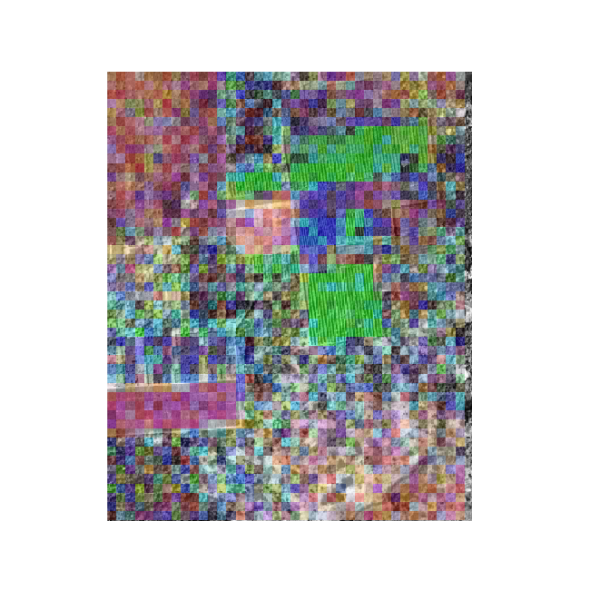
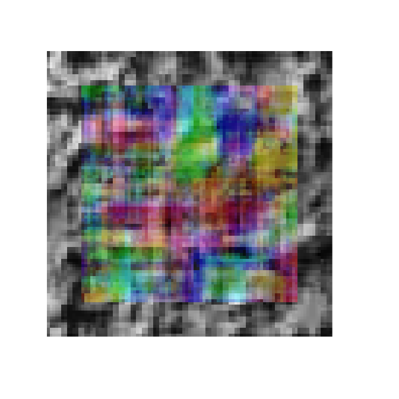

<!-- README.md is generated from README.Rmd. Please edit that file -->

[](https://travis-ci.org/khufkens/foto)
[](https://codecov.io/gh/khufkens/foto)
[](https://cran.r-project.org/package=foto)
[](https://cran.r-project.org/package=foto)
<a href="https://www.buymeacoffee.com/H2wlgqCLO" target="_blank"></a>

# FOTO

The FOTO (Fourier Transform Textural Ordination) method uses a principal
component analysis (PCA) on radially averaged 2D Fourier spectra to
characterize (grayscale) image texture. The FOTO method was described by
[Couteron et
al. 2005](http://onlinelibrary.wiley.com/doi/10.1111/j.1365-2664.2005.01097.x/abstract;jsessionid=359DD0662C272A59AF94FAEF3F213156.f02t04)
to quantify canopy stucture in relation to biomass and biodiversity.
More recently, the code base of this package was used in a similar study
by [Solorzano et
al. 2018](http://spie.org/Publications/Journal/10.1117/1.JRS.12.036006?SSO=1).
Although the techiques as presented in these papers is applied on a
canopy level, the principle works on images of all types.

## Installation

### stable release

To install the current stable release use a CRAN repository:

``` r
install.packages("foto")
library("foto")
```

### development release

To install the development releases of the package run the following
commands:

``` r
if(!require(devtools)){install.package("devtools")}
devtools::install_github("khufkens/foto")
library("foto")
```

Vignettes are not rendered by default, if you want to include additional
documentation please use:

``` r
if(!require(devtools)){install.package("devtools")}
devtools::install_github("khufkens/foto", build_vignettes = TRUE)
library("foto")
```

## Use

To classify image texture using the FOTO algorithm use the `foto()`
function. The `foto()` routine returns a nested list with the source
data (aggregated zones used and fourier components used in the PCA
analysis) and a final colour image consisting of the three major
principal components for every pixel.

<details>

<summary>detailed parameter description (click to expand)</summary>

<p>

| Parameter    | Description                                  |
| ------------ | -------------------------------------------- |
| x            | a raster layer (stack or brick)              |
| window\_size | a window size in pixels                      |
| plot         | plot output (TRUE / FALSE)                   |
| normalize    | normalize the radial spectrum (TRUE / FALSE) |
| method       | “zones” or “mw” (i.e. moving window)         |

</p>

</details>

### Zones

The original implementation used discrete zones (blocks of x pixels
wide, window\_size parameter) to classify an image. This original
implementation is the default, and the least computationally intensive,
as it effectively reduces to resolution of the orignal data. In short,
data is aggregated at the size of the specified window.

An example analysis is run below. In the resulting image pixels with a
similar colour have a similar texture. The analysis is run on a
historical image of plantations near Yangambi, DR Congo, as recovered in
the [COBECORE project](http://cobecore.org/). The regular pattern of
planted trees is picked up readily by the algorithm.

``` r
# load the library
library(foto)

# load demo data
r <- raster::raster(system.file("extdata", "yangambi.png",
                          package = "foto",
                          mustWork = TRUE))

# classify pixels using zones (discrete steps)
output <- foto(r,
     plot = TRUE,
     window_size = 25,
     method = "zones")
```

<!-- -->

``` r

# print data structure
print(names(output))
#> [1] "zones"  "output" "RGB"
```

### Moving window

To maintain the resolution of the original image a moving window
approach can be used (method = “mw”). This approach overlays a window of
size x (window\_size parameter) on every pixel in the image and applies
the FOTO methodology. This obviously represents a considerable
computational burden and should be used with caution. An example is
given below for a smaller subsection of the processed image above. The
output format of the moving window analysis is consistent with that of
the zoned approach.

``` r
# crop the image for speed
r <- crop(r, extent(1,100,1,100))

# crop the image
output <- foto(r,
     plot = TRUE,
     window_size = 25,
     method = "mw")
#> A moving window approach is computationally intensive.
#> This might take a while.
```

<!-- -->

## Partitioned normalization

Partiotioned normalization as described in [Barbier et
al. 2010](http://doi.wiley.com/10.1111/j.1466-8238.2009.00493.x) is not
provided but easily accomplished once all images are processed. I refer
to this paper for the appropriate routines.

## References

  - Couteron P, Pelissier R, Nicolini E a., Paget D (2005) Predicting
    tropical forest stand structure parameters from Fourier transform of
    very high-resolution remotely sensed canopy images. Journal of
    Applied Ecology, 42, 1121–1128.

  - Barbier N, Couteron P, Proisy C, Malhi Y, Gastellu-Etchegorry J-P
    (2010) The variation of apparent crown size and canopy heterogeneity
    across lowland Amazonian forests. Global Ecology and Biogeography,
    19, 72–84.

  - Solórzano JV, Gallardo-cruz JA, González EJ et al. (2018)
    Contrasting the potential of Fourier transformed ordination and gray
    level co-occurrence matrix textures to model a tropical swamp forest
    ’ s structural and diversity attributes. Journal of Applied Remote
    Sensing, 12, 036006.

## Acknowledgements

This package is supported through the Belgian Science Policy office
COBECORE project (BELSPO; grant BR/175/A3/COBECORE).
